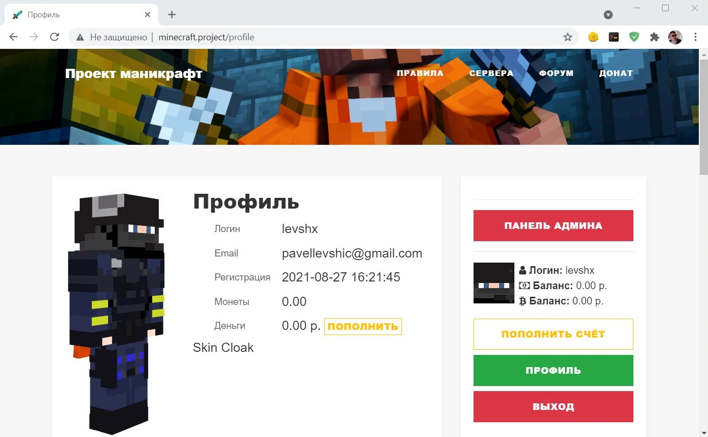
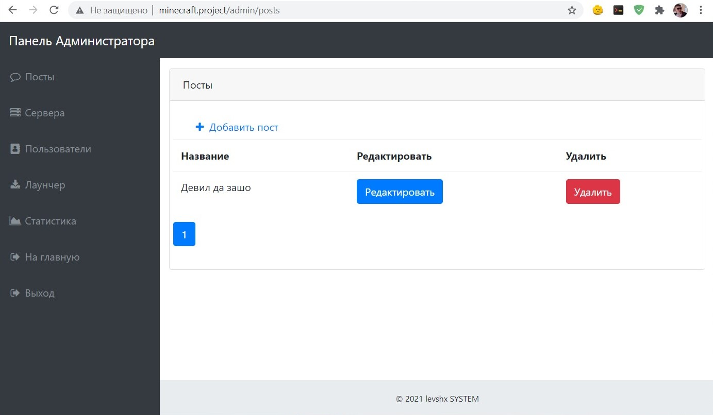
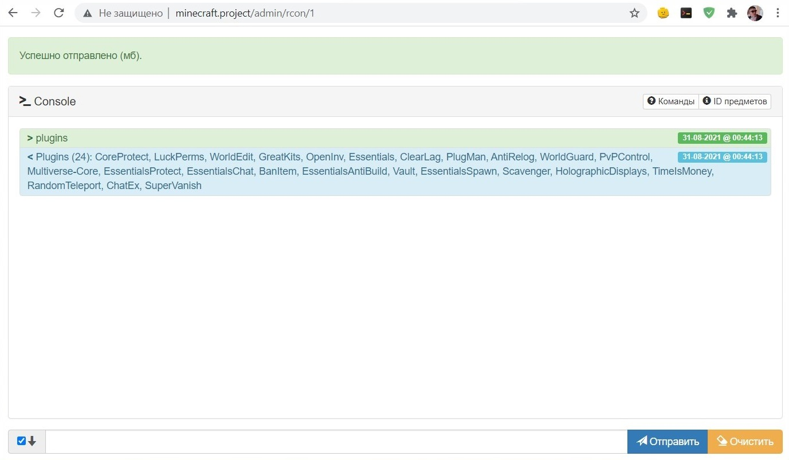

# mc-php

<!-- # Short Description -->

Minecraft Project site admin tools

<!-- # Badges -->

# Tags

`Minecraft` `PHP` `RCON` `MVC` `Server`

# Demo

Страница профиля  

Панель администратора  

RCON панель управления сервером

# Advantages

TO DO

# Installation

TO DO

# Deployment

 * Install php8.0
 * Install MySQL server
 * Clone this repository 
 * Create DB -> Migrate db.sql -> edit config db.php
 * Run apache/ngnix with RewriteEngine to index.php

# Minimal Example

TO DO

# Contributors

- [levshx](https://github.com/levshx)

# Users

- bng

<!-- CREATED_BY_LEADYOU_README_GENERATOR -->